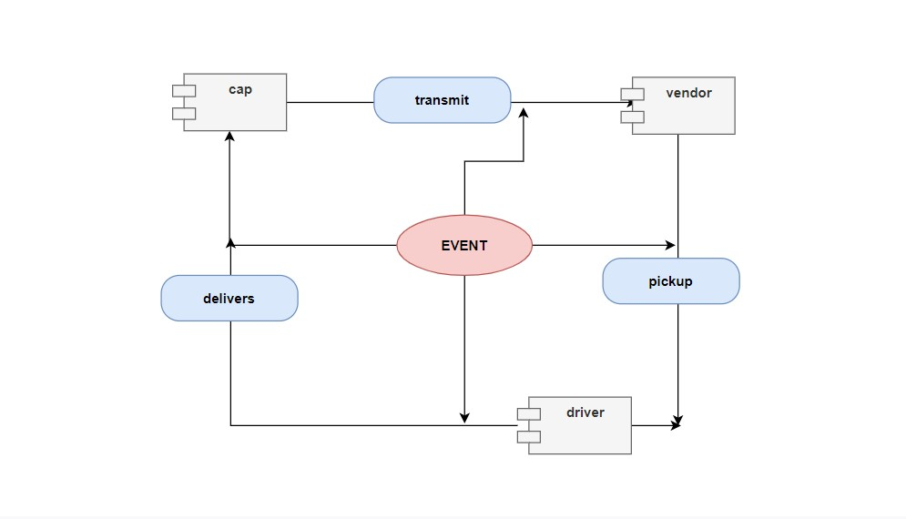
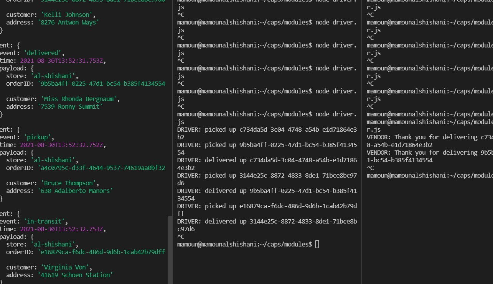

# caps

## uml :

* [GitHub Repo Link](https://github.com/MAMOUN-kamal-alshisani/caps)

* [Pull Request](https://github.com/MAMOUN-kamal-alshisani/caps/pull/3)

<!-- * [Heroku Link](https://api-auth-mine.herokuapp.com/signUp)  -->

##### Setup
.env quirements
  * STORE 

**Running the app**
* `node cap.js`
* Endpoints:
* ##### 1 -  `/status`

***Returns Object***

Event: {
  event: 'pickup',
  time: 2021-08-29T12:47:44.420Z,
  payload: {
    store: 'al-shishani',
    orderID: 'b22ebc77-5071-49ab-9eba-655e16e8cce3',
    customer: 'Kristie Nicolas I',
    address: '6832 Carlo Lodge'
  }
}
DRIVER: picked up b22ebc77-5071-49ab-9eba-655e16e8cce3
Event: {
  event: 'in-transit',
  time: 2021-08-29T12:47:46.425Z,
  payload: {
    store: 'al-shishani',
    orderID: 'b22ebc77-5071-49ab-9eba-655e16e8cce3',
    customer: 'Kristie Nicolas I',
    address: '6832 Carlo Lodge'
  }
}
DRIVER: delivered up b22ebc77-5071-49ab-9eba-655e16e8cce3
VENDOR: Thank you for delivering b22ebc77-5071-49ab-9eba-655e16e8cce3
Event: {
  event: 'delivered',
  time: 2021-08-29T12:47:49.427Z,
  payload: {
    store: 'al-shishani',
    orderID: 'b22ebc77-5071-49ab-9eba-655e16e8cce3',
    customer: 'Kristie Nicolas I',
    address: '6832 Carlo Lodge'
  }
}
**Tests**

***Unit Tests: npm test***
